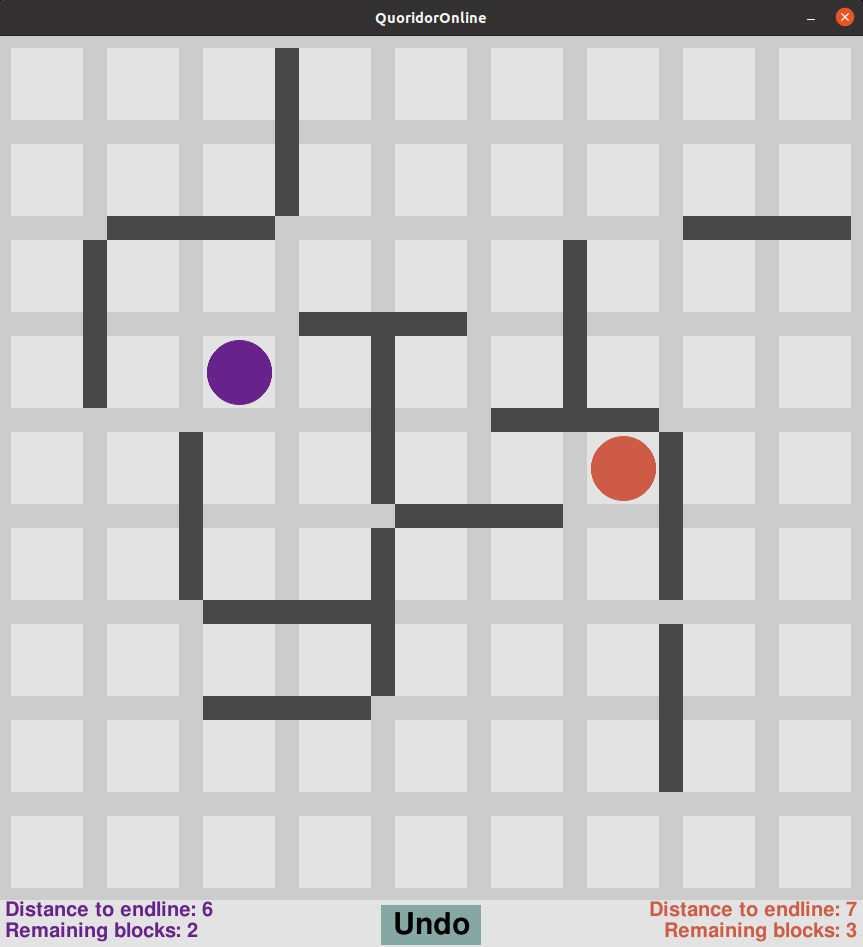

# Quoridor

Quoridor is a two player board game which rules can be found [here](https://en.wikipedia.org/wiki/Quoridor)

### Running:

Ip address in run_server.sh and play.sh should be modified.
run_server.sh should be run only once per game on the server side. 
Both players should run play.sh.

